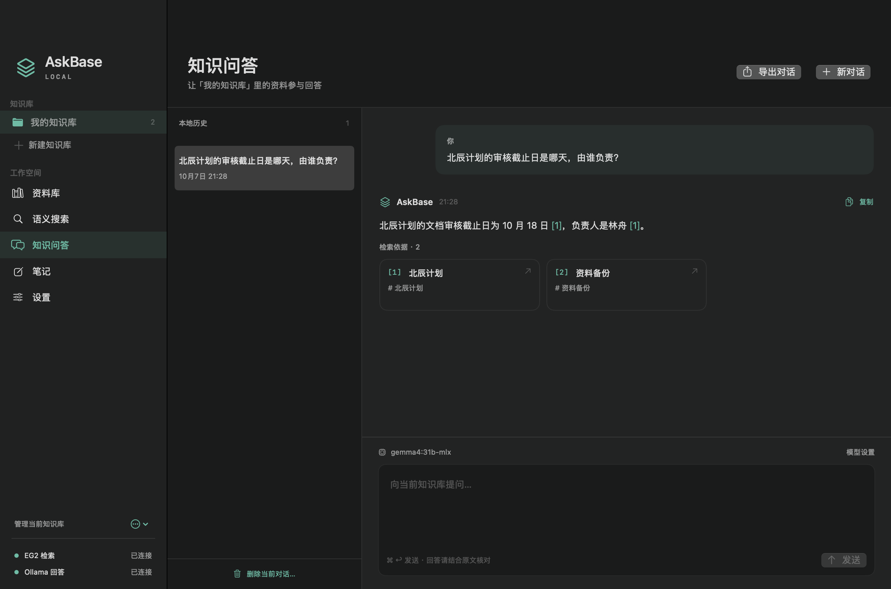

# AskBase Local

原生 macOS 本地知识库。把文档、图片、音频和视频留在自己的 Mac 上，用 **EmbeddingGemma 2** 搜索，再用本地回答模型对文字资料做带来源的 RAG 问答。

开源许可证：[Apache License 2.0](LICENSE)。

这是一个独立的 macOS 应用项目，参考 AskBase 的资料库、检索和问答流程。它不会连接或同步云端 AskBase 的数据库。



上图是实际原生窗口，使用仓库中的虚构资料和本地模型完成问答。

## 功能

- **多知识库**：按项目分开资料、对话和笔记。
- **导入资料**：选择文件或文件夹、拖放导入；不设文件大小、数量、页数、目录层级或扩展名配额；完整文件 SHA256 去重。
- **语义搜索**：EmbeddingGemma 2 768 维向量，加上轻量关键词排序；查看片段和原文副本。
- **多模态检索**：图片、音频、视频直接生成原生向量；可以用文字或媒体文件搜索当前知识库。
- **媒体预览**：查看图片指定帧／页；播放音视频并定位到检索命中的时间段。
- **知识问答**：检索文字原文和图片／视频的实际 OCR 文字，再调用本机 Ollama；保存对话历史，回答附带编号来源；回车发送、Shift＋回车换行。
- **资料管理**：重命名、收藏、标签、重新索引、删除；清除相关索引和失效来源。
- **个人笔记**：独立编辑、保存、导出 Markdown。笔记不会自动成为检索资料。
- **本地模型设置**：检查两个模型服务的连接状态，选择已安装的回答模型；只允许本机地址。

音频嵌入用于检索，不自动转写；无可读文字的媒体请先搜索和播放，不能直接作为文字问答的事实依据。扫描 PDF 仍需先 OCR。当前不支持网页抓取、自动 Wiki、图谱、MCP 或云端同步。尚无大规模语料性能或真实业务检索质量结论。

### 文件导入

0.2.0 移除了原先的 32 MiB 文件、200 万文本单元、2,000 页 PDF、1,000 个文件、10,000 个目录条目及 16 层目录限制，也取消了扩展名白名单。

| 内容 | 提取方式 |
| --- | --- |
| PDF | 提取文字并保留原始页码，空白页不改变后续页号 |
| Word DOCX、Excel XLSX、PowerPoint PPTX | 读取文档正文、表格单元格或幻灯片文字 |
| RTF、ODT、EPUB | 提取富文本、开放文档或电子书章节中的文字 |
| 本地 HTML/XHTML | 提取正文文字，忽略脚本和样式，不加载外部页面或资源 |
| Markdown、TXT、CSV/TSV、JSON/XML、代码及其他文本 | 严格识别 UTF-8 / UTF-16 / UTF-32；接受自定义扩展名和无扩展名文件 |
| 图片 | ImageIO 解码，保留方向及每个帧／页；图片本身进入视觉编码器，并在本机尝试 OCR |
| 音频 | AVFoundation 解码、转为 16 kHz 单声道 PCM；按不超过 10 秒的片段完整索引 |
| 视频 | 按不超过 10 秒分段，每段均匀抽取 1–8 帧；有音轨时一同编码，保留时间段和原片采样时间点 |

格式主要按内容识别，媒体支持范围取决于 macOS 的 ImageIO / AVFoundation 解码能力。损坏文件、系统不能解码的媒体、旧版二进制 DOC/XLS/PPT、XLSB 和 iWork 文件需要先转换。单个文件解析失败会在导入结果中列出，其他文件继续处理。

办公文档提取覆盖主要文字内容，不还原排版。DOCX 页眉、页脚、脚注和 PPTX 演讲备注尚未提取；XLSX 读取已存储的值，缺少缓存值时保留公式文字，不重新计算公式或转换日期样式。PDF 和 PPTX 保留页／幻灯片编号，工作表与 EPUB 章节按原顺序提取。

含有外部合并正文（`altChunk`）的 DOCX 需要先用 Word 打开并另存。办公文档声明的主部件或 EPUB 章节缺失时会明确报错，避免把不完整正文当作成功导入。

导入按 1 MiB 缓冲分段复制和计算哈希，再从同一份暂存副本解析，避免哈希、文字和原文对应不同版本。应用不设固定导入配额，但文本、分块和向量仍占用内存，暂存文件和原文副本也需要磁盘空间；实际容量取决于 Mac 资源。

文件夹导入跳过隐藏项、应用包和符号链接。可以在选择面板中直接选中隐藏文件导入。处理过程中可停止，已完成的资料保留，未完成的索引可重试。

### iCloud Drive、OneDrive 等云盘文件

0.3.1 在读取文件前通过 macOS 协调访问，等待支持 File Provider 的云盘准备本地内容，再保存到应用自己的资料副本中。后续解析和索引使用同一份副本；云盘属性更新不会再被直接误判为正文改变。若读取期间文件确实改写或替换，会自动重新读取，最多尝试三次；等待下载期间可以停止导入。

云盘客户端需要正常登录并能取得文件。若下载或同步失败，可以在 Finder 中右键文件，选择 iCloud 的“立即下载”或 OneDrive 的“始终保留在此设备上”，等下载完成后再次导入。没有重新加入原文件大小或数量限制，已有成功导入的资料无需重建索引。

### 图片、语音与视频

0.3.0 启用 EmbeddingGemma 2 已有的视觉和音频组件，使用同一个共享向量空间。资料导入后，可输入“讨论交付日期的录音”“红色圆形图片”等描述检索，也可以点击“用媒体搜索…”选择图片、录音或视频。查询文件只用于本次搜索，不会自动加入资料库。

音视频覆盖从开始到结束的全部分段，尾段也会索引；长文件需要更多处理时间和磁盘空间。10 秒与 8 帧是单次模型处理范围，不是原文件时长或大小限制。视频采用抽帧，不能保证检索到每个短暂画面。图片和视频中的 OCR 可能识别错误，查看原图或播放原片可核实。

本版没有新增语音识别模型、麦克风录音或自动转写，也没有把音频或视频发送给文字回答模型。语音内容能否准确检索受语言、噪声和模型能力影响；合成工程验收不能替代实际资料上的效果评估。

## 快速开始

从 [Releases](https://github.com/wyatt88/AskBaseMac/releases) 下载 Apple Silicon 安装包，解压后把 `AskBase Local.app` 放入“应用程序”。模型服务单独准备，步骤见下文。

从源码构建：

需要 Apple Silicon Mac、macOS 14+、Xcode 16+（Swift 6）和 Python 3。首次安装模型服务需要网络，后续推理使用本地文件。

```sh
git clone https://github.com/wyatt88/AskBaseMac.git
cd AskBaseMac
swift test
python3 scripts/build_app.py --install
open "$HOME/Applications/AskBase Local.app"
```

构建脚本生成真正的 `.app`，安装到 `~/Applications`，并生成 `dist/AskBase-Local-0.3.2-macOS-arm64.zip`。构建副本保存在 `dist/build-products.noindex/`，避免与安装版同时出现在系统应用搜索中；许可文件随应用打包。应用使用本地临时签名，尚未做 Apple 开发者签名、公证或 App Store 发布。其他 Mac 下载预编译版本时可能需要在系统设置中允许打开；也可以直接从源码构建。

### EmbeddingGemma 2

已有兼容服务时直接复用。初次准备需先[安装 uv](https://docs.astral.sh/uv/getting-started/installation/)，然后：

```sh
python3 scripts/setup_embedding.py
```

脚本下载并校验固定版本，创建独立 Python 环境，将服务安装到 `~/Library/Application Support/AskBase/EmbeddingGemma2`。服务使用 Apple GPU，监听 `http://127.0.0.1:8871`，提供 `/health`、文字 `/v1/embeddings` 和媒体 `/v1/media/embeddings`。

从旧版升级时也运行此脚本。它核实既有 AskBase 服务身份后升级原文本服务；不会停止其他程序占用的服务。设置页中的媒体能力以实际 `/health` 返回为准。

| 项目 | 配置 |
| --- | --- |
| 模型 | `google/embeddinggemma-2` |
| 固定 revision | `914f7f89142e33e77833254d9c9b90c3cef7303b` |
| 编码路径 | 文本 / 代码 / 图片 / 音频 / 视频，BF16，MLX |
| 向量维度 | 768 |
| 查询 / 文档 | 显式区分 query / document；文字按官方方式加前缀，纯媒体不加文字前缀 |
| 权重 | 首次下载约 1.53 GB；不会提交进 Git |

应用把编码签名和维度一起存入索引，媒体另保存其编码签名及预处理版本。本次升级保持文本编码器和已有文本签名不变；完整模型在启动时通过文本一致性检查才启用媒体。以后若编码签名或媒体预处理版本变化，需要重新索引受影响的资料；同维度不能保证向量兼容。

### 本地回答模型

[安装 Ollama](https://ollama.com/download/mac) 并准备一个本地生成模型。应用不会自动下载额外大模型，也不使用云端回答 API。可以使用自己已有的模型；机器内存和模型大小应匹配。

```sh
python3 scripts/start_ollama.py
ollama list
```

服务启动脚本使用本地已安装的 Ollama。由脚本新建的服务绑定 `127.0.0.1:11434` 并禁用 Ollama 云端功能；复用已有服务时保留其配置。应用在发送资料前另行核对所选模型的本地元数据，拒绝云端模型。设置中选择 `ollama list` 对应的模型；只有一个可用模型时应用可自动选择。

Embedding 模型已就绪即可导入、检索。知识问答另外需要本地回答模型。

## 试用

启动后用“导入资料”选择仓库中的 `Examples/`。其中是明确标注的虚构资料，不包含真实个人文件。

可以提问：

> 北辰计划的审核截止日是哪天，由谁负责？

点击答案下方来源，核对正文和页码。来源卡表示检索依据，并不自动证明模型的解读正确。

## 数据与日常管理

- 资料、向量、笔记和历史：`~/Library/Application Support/AskBaseMac/`
- 原文副本：上述目录的 `Originals/`
- 应用不会自动扫描私人目录，只处理用户选择的文件和文件夹。
- 导入时复制原文；之后修改原来的文件不会自动同步。需要重新导入新版并按需删除旧版。
- 备份前退出应用，完整复制数据目录。模型可以重新下载，原始资料和数据库请一起保留。
- 应用退出后模型服务仍可供其他本机客户端使用。服务停止与恢复方法见[模型服务说明](services/embeddinggemma2/README.md)。
- 不要同时使用 CLI 和 GUI 修改同一个真实资料库；集成测试使用独立临时目录。

## 开发与验证

```sh
swift test
python3 scripts/test_setup_guards.py
python3 services/embeddinggemma2/scripts/test_deployment_guards.py
swift run askbase status
swift run askbase smoke
swift run askbase smoke --model gemma4:31b-mlx
swift run askbase media-smoke
python3 scripts/verify_import_formats.py
```

带 `--model` 的命令需要本机已安装对应模型，也可替换为自己的模型名。`smoke` 自动创建并删除隔离库，验证导入、去重、检索、重建索引、来源撤销和持久化；给出模型名时也实际生成答案。`verify_import_formats.py` 使用真实本机嵌入服务和 10 份合成格式样本，检查文字、原文、向量和检索，全程使用自动清理的独立临时库。

`media-smoke` 生成合成图片、文字海报、音调、有声／无声视频，验证原生向量、完整分段、OCR 来源、文字／媒体查询、重建和删除。它需要已启用全部模态的本机服务；不使用私人资料，也不代表自然语音或真实视频检索质量。

- [架构与数据边界](docs/ARCHITECTURE.md)
- [实际验收记录](docs/VERIFICATION.md)
- [0.2.0 导入更新与验收](docs/IMPORT-UPDATE-0.2.0.md)
- [0.3.0 多模态更新与验收](docs/MULTIMODAL-UPDATE-0.3.0.md)
- [0.3.0 多模态验收协议](docs/MULTIMODAL-PROTOCOL-0.3.0.md)
- [0.3.2 输入框与回车发送](docs/CHAT-COMPOSER-0.3.2.md)
- [0.3.1 云盘导入修复](docs/CLOUD-IMPORT-FIX-0.3.1.md)
- [实现契约](docs/IMPLEMENTATION-CONTRACT.md)
- [独立审查](docs/REVIEW.md)
- [第三方组件](THIRD_PARTY_NOTICES.md)

CI 只构建应用和运行离线测试，不下载模型，也不访问私人资料。默认资料库保存在仓库外；Git 忽略规则覆盖数据库、`Originals/` 原文副本目录、模型权重、Python 环境和本地运行日志，不会自动识别其他位置的私人文档或导出文件。

## 开源许可

本项目的原创代码、文档与应用素材采用 [Apache License 2.0](LICENSE)，允许商业使用、修改和再分发，并包含贡献者对其贡献所涉及专利的授权条款。再分发时须遵守许可证，包括保留许可与适用的归属声明、标明修改；详见 [NOTICE](NOTICE) 和许可证全文。

EmbeddingGemma 2、Ollama、其他依赖和用户选择的回答模型分别遵循各自的许可证。本项目的许可证不替代模型或第三方组件的条款；模型权重和第三方运行环境不随应用分发。组件来源和许可见 [THIRD_PARTY_NOTICES.md](THIRD_PARTY_NOTICES.md)。
