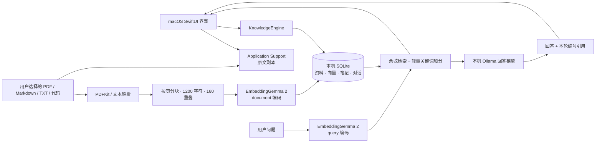

# 本地架构

## 本机边界

- macOS 14+ 的原生应用，SwiftUI / PDFKit / SQLite / Accelerate；无 Swift 第三方包。
- 内置 EmbeddingGemma 2 服务安装脚本面向 Apple Silicon。
- 应用只接受 `localhost`、`127.0.0.1` 或 `[::1]` 模型地址；不自动跟随 HTTP 重定向、不使用系统 HTTP 代理、不接入云回答接口。
- 第一次安装 Python 依赖和权重需要网络。推理使用已下载模型；程序无遥测、无账户、无云同步。
- 数据目录：`~/Library/Application Support/AskBaseMac/`。SQLite 保存元数据和向量；`Originals/` 保存用户导入的副本。
- 模型单独运行：EG2 `127.0.0.1:8871`，Ollama `127.0.0.1:11434`。退出应用不删除资料或停止共用的模型服务。

## 索引一致性

1. 同一知识库按文件完整 SHA256 去重。文件名相同、内容不同的资料可以并存；用户决定是否删除旧版。
2. 导入状态从 indexing 到 ready 必须有非空文字、非空分块、有限且 L2 归一化的 768 维向量和同一编码签名。
3. 按文档事务提交完整索引；错误向量不会留下“半份可检索文档”。重新索引失败时保留已就绪旧索引。
4. 每个 chunk 记录 `encoderSignature` 和 dimensions。搜索遇到签名不同明确要求重建索引，不混用同维不同空间。
5. 删除资料或知识库同时移除向量与原文副本，并撤销历史回答里的相关来源。保存的回答正文是历史记录，不能当作仍有效的来源。
6. 启动时把中断的 indexing 标为可重试错误。不同窗口共用一个应用状态；CLI 不应与 UI 同时修改同一真实库。

## 检索与问答

向量余弦分数加上最高 0.08 的关键词覆盖加分，默认取 6 段。这是首版轻量混合排序，没有 reranker，也没有专用中文检索基准结论。排序分数不是答案可信度。

问题用 `input_type=query`，资料用 `input_type=document`。服务负责前缀，应用不重复拼接。长文在应用侧按字符分块，保持 PDF 页码；扫描 PDF 需要用户先 OCR。

每次发送资料前，应用先用仅包含模型名的 `/api/show` 请求检查模型属性；拒绝云模型、云模型别名、缺少本地格式／架构／生成能力信息的模型。标准 Ollama 的本地模型检查通过后，生成器才收到本轮检索片段和最多四条有界历史消息。

资料被标记为待分析数据；要求答案依据片段并使用 `[1]` 编号。除明确表示资料不足的拒答外，正文必须含有效来源编号。应用拒绝超出范围、整数溢出、全角或其他非规范编号，并在返回后复核来源仍存在。正文编号对应下方“检索依据”中的卡片；候选片段不一定被正文引用。模型仍可能对有效来源作错误解释，用户可查看原文。

## 当前范围

首版已实现：多知识库、文件和文件夹导入、语义搜索、对话历史、来源查看、收藏和标签、个人笔记、Markdown 导出、模型连通性与选择。实际检查范围见 [VERIFICATION.md](VERIFICATION.md)。

本版本不做网页抓取、扫描 PDF OCR、DOCX/PPTX 转换、知识图谱、自动 Wiki、MCP、云端 AskBase 同步。笔记是独立编辑内容，不自动混入检索语料；需要检索时可导出 Markdown 后导入。

SQLite 中逐段存储向量并在本机做精确检索，适合先验证个人资料库。没有进行十万级片段负载测试，不能将其描述为大规模向量数据库。
