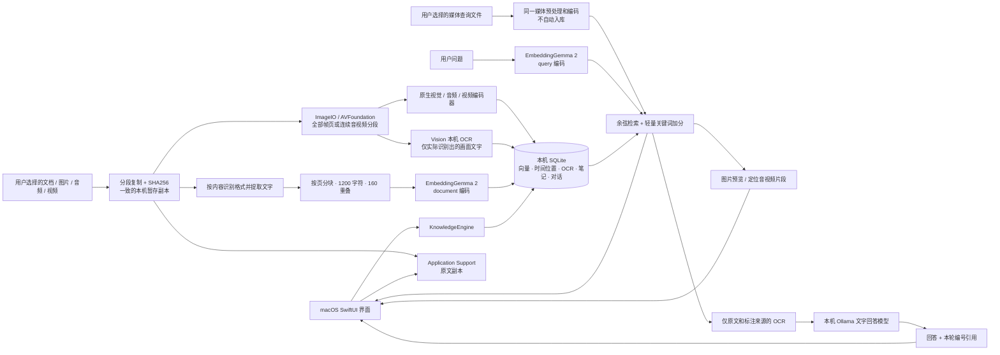

# 本地架构

## 本机边界

- macOS 14+ 的原生应用，SwiftUI / PDFKit / ImageIO / AVFoundation / AVKit / Vision / SQLite / Accelerate；无 Swift 第三方包。
- 内置 EmbeddingGemma 2 服务安装脚本面向 Apple Silicon。
- 应用只接受 `localhost`、`127.0.0.1` 或 `[::1]` 模型地址；不自动跟随 HTTP 重定向、不使用系统 HTTP 代理、不接入云回答接口。
- 第一次安装 Python 依赖和权重需要网络。推理使用已下载模型；程序无遥测、无账户、无云同步。
- 数据目录：`~/Library/Application Support/AskBaseMac/`。SQLite 保存元数据和向量；`Originals/` 保存用户导入的副本。
- 模型单独运行：EG2 `127.0.0.1:8871`，Ollama `127.0.0.1:11434`。退出应用不删除资料或停止共用的模型服务。

## 索引一致性

1. 同一知识库按文件完整 SHA256 去重。文件名相同、内容不同的资料可以并存；用户决定是否删除旧版。
2. 导入状态从 indexing 到 ready 必须有有效原文或可解码媒体、非空分块、有限且 L2 归一化的 768 维向量和同一编码签名。媒体还需连续完整的分段位置及一致的媒体签名。
3. 按文档事务提交完整索引；错误向量不会留下“半份可检索文档”。重新索引失败时保留已就绪旧索引。
4. 每个 chunk 记录 `encoderSignature` 和 dimensions。搜索遇到签名不同明确要求重建索引，不混用同维不同空间。
5. 删除资料或知识库同时移除向量与原文副本，并撤销历史回答里的相关来源。保存的回答正文是历史记录，不能当作仍有效的来源。
6. 启动时把中断的 indexing 标为可重试错误。不同窗口共用一个应用状态；CLI 不应与 UI 同时修改同一真实库。
7. `LibraryDocument`、`DocumentChunk`、`SearchResult` 的媒体字段为可选，兼容旧版记录。媒体块记录原始时间范围、视频采样时间点或图片帧号、音轨存在状态、OCR 来源、媒体编码签名和客户端配方。
8. 此次升级保留原文本编码器文件和签名。完整模型启动时验证文本向量逐项相等，才签发与旧文本索引共享的编码身份。服务的独立媒体签名和 App 预处理配方不匹配时，要求重建受影响资料。

## 导入与资源

0.2.0 取消文件字节数、提取文本量、PDF 页数、单次数量、目录条目数、目录深度和扩展名白名单的固定上限。目录枚举保留去重与取消检查；跳过隐藏后代、应用包、符号链接，直接选中的隐藏普通文件可以导入。

输入先通过普通文件检查，以 1 MiB 缓冲复制到私有暂存目录并计算 SHA256；复制前后核对文件大小和修改信息。解析与最终原文复制共用此快照，完成或失败后清理暂存目录。原文经独占暂存文件和原子安装保存，文件名为 UUID，可附带扩展名。

PDFKit 保留页码；纯文本严格解码 UTF-8 / UTF-16 / UTF-32；办公文档和电子书按容器内容提取文字。压缩成员不展开到用户目录，XML 不加载外部实体。文字分块用 String 索引遍历，避免把整份长文转换成 Character 数组；导入和重建过程中可取消。

媒体按文件内容识别。图片按方向校正后生成最长边不超过 1024 像素的 JPEG；多页／多帧图片逐帧处理。音视频逐段解码，每段不超过 10 秒，音频转换为 16 kHz 单声道 PCM16 WAV，视频每段抽取 1–8 帧并附带该段音轨。完整原文件始终保留，不将单片段字节限制变成原文件容量限制。

`frameTimes` 保存原片时间线上请求采样的位置，不是容器中编码帧的 PTS；在静止画面或短尾段中，多个采样位置可能对应同一画面。音频尾段不足 20 毫秒时调整前一段边界，连续覆盖完整文件；整个音频不足 20 毫秒则明确拒绝。

媒体请求只传编码后的字节，不传任意文件路径或 URL。预处理一次保留一段媒体的负载；服务端解码、预处理和 MLX 推理共用串行 worker，取消 HTTP 等待不会释放仍在执行的推理槽位。所有片段成功之后才事务提交，取消或失败没有半份 ready 索引。

无固定配额不意味着恒定内存：解码文字、分块和向量仍驻留内存；大文件需要额外暂存磁盘空间。此版本没有验证任意文件容量或超大语料的性能。

## 检索与问答

向量余弦分数加上最高 0.08 的关键词覆盖加分，默认取 6 段。这是首版轻量混合排序，没有 reranker，也没有专用中文检索基准结论。排序分数不是答案可信度。

问题用 `input_type=query`，资料用 `input_type=document`。服务负责前缀，应用不重复拼接。长文在应用侧按字符分块，保持 PDF 页码；扫描 PDF 需要用户先 OCR。

纯媒体按模型官方方法不加文字前缀。媒体查询遍历查询文件的各个片段，对每个库内来源保留最高相似度；查询文件不会入库。音频没有自动转写；媒体占位标签不能成为关键词正文或文字 RAG 证据。问答在 top-K 之前排除无可读文字的媒体，防止它们挤出真正的文字来源。

OCR 只提供识别到的画面文字，不代表完整视觉理解或音视频转写。来源弹窗保留原始帧／页和时间段，播放使用本机副本；关闭或切换时停止并释放播放器。

每次发送资料前，应用先用仅包含模型名的 `/api/show` 请求检查模型属性；拒绝云模型、云模型别名、缺少本地格式／架构／生成能力信息的模型。标准 Ollama 的本地模型检查通过后，生成器才收到本轮检索片段和最多四条有界历史消息。

资料被标记为待分析数据；要求答案依据片段并使用 `[1]` 编号。除明确表示资料不足的拒答外，正文必须含有效来源编号。应用拒绝超出范围、整数溢出、全角或其他非规范编号，并在返回后复核来源仍存在。正文编号对应下方“检索依据”中的卡片；候选片段不一定被正文引用。模型仍可能对有效来源作错误解释，用户可查看原文。

## 当前范围

已实现：多知识库、文件和文件夹导入、PDF／办公文档／电子书／文本提取、图片／音频／视频原生索引、文字和媒体语义搜索、图片预览、片段定位播放、本机画面 OCR、对话历史、来源查看、收藏和标签、个人笔记、Markdown 导出、模型连通性与选择。实际检查范围见 [VERIFICATION.md](VERIFICATION.md)。

本版本不做网页抓取、扫描 PDF OCR、音视频转录、旧版二进制 DOC/XLS/PPT 转换、知识图谱、自动 Wiki、MCP、云端 AskBase 同步。笔记是独立编辑内容，不自动混入检索语料；需要检索时可导出 Markdown 后导入。

SQLite 中逐段存储向量并在本机做精确检索，适合先验证个人资料库。没有进行十万级片段负载测试，不能将其描述为大规模向量数据库。
