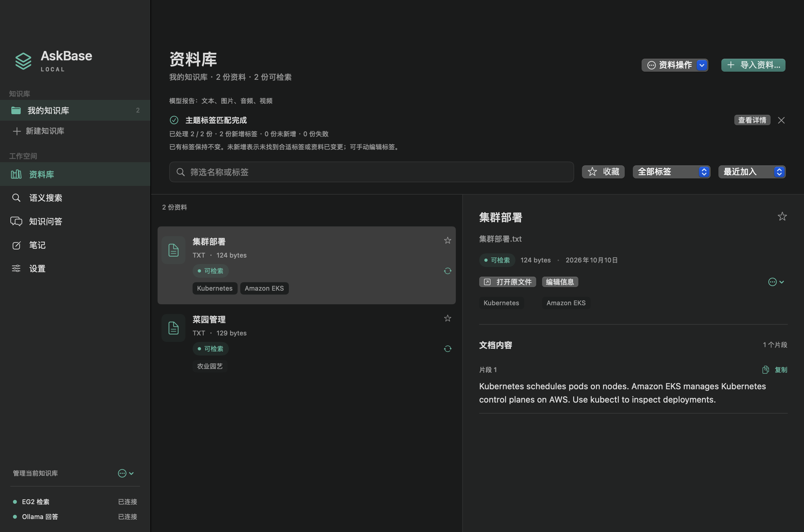
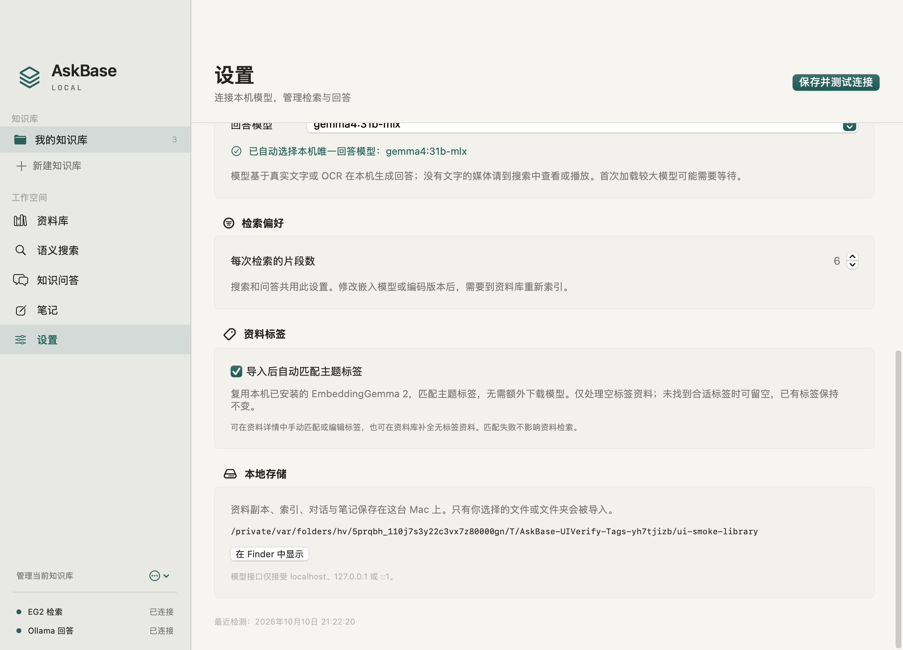

# 0.4.0 自动主题标签

AskBase Local 复用本机已有的 EmbeddingGemma 2，在资料导入完成后匹配主题标签。无需下载新模型，也不调用 Ollama 回答模型或云端服务。

## 使用方式

- **新资料**：导入并完成索引后自动匹配，最多添加 5 个标签。
- **已有资料**：资料库右上角“资料操作”→“为无标签资料补全标签”，仅处理当前知识库中可检索且标签为空的资料。顺序执行，显示进度，支持停止。
- **单份资料**：空标签资料的详情页点击“匹配主题标签”。
- **人工调整**：“编辑信息”中增删标签；已有标签不会被自动覆盖。若希望重新匹配，先主动清空标签。
- **关闭自动匹配**：设置→资料标签→关闭“导入后自动匹配主题标签”，然后保存。手动匹配入口仍可使用。
- **筛选**：资料库“全部标签”菜单可以筛选自动或手动标签。

升级后默认启用新资料自动匹配；应用不会主动批量修改旧资料。匹配不确定时可以留空，失败会单独显示提示，已完成的索引继续可检索。

## 实现与边界

EmbeddingGemma 2 是向量模型，本功能做候选主题分类，不生成任意的新标签名称。候选包括 56 个内置中英主题，以及当前知识库里已有的标签；按使用频次、名称稳定排序，总候选最多 128 个，标签名不超过 32 个字符。不同知识库的自定义标签不会互相混入。

资料内容向量直接复用已有索引。候选标签作为短查询编码，每批不超过 8 条，按本机端点、编码签名和完整候选描述缓存；缓存仅在当前进程内使用。大资料均匀抽取最多 24 个分块参与主题判断，避免标签操作重复编码整本书或整段视频。此采样只用于标签匹配，不缩短原资料或检索索引。

主题得分结合分块相似度及实际文字里的关键词支持；标签还需要超过最低相似度、候选中位数的分差，以及相对最佳标签的分差。分数不是置信概率。没有明显匹配的资料保留空标签；采样、OCR 错误、候选词表覆盖不足都可能导致漏标或误标，需要人工调整。

图片、音频、视频复用其已有媒体向量。只有真实文字或 OCR 参与关键词支持，媒体文件名和占位描述不当作正文。本次质量检查只覆盖合成文字资料，未验证真实图片、录音、长视频和大型 PDF 的标签质量；自动标签不等于转写或事实提取。

写入前重新校验资料仍可检索、标签仍为空，且更新时间没有变化，并在 SQLite 单事务中完成比较与写入。手动编辑、删除、取消和重索引后的迟到响应不能覆盖新状态。索引先独立提交，标签匹配失败或被取消不会将已经完成的资料标为索引失败。

旧版设置无需手动迁移，没有新增数据库表或下载任何模型文件。

## 验证

本轮为本地工程验证，不标为论文复现或真实业务 E4 验收。

- 全部 181 项核心测试通过，其中新增 28 项独立离线回归：旧设置兼容、导入开关、失败隔离、取消、编辑／删除／重索引竞态、跨连接写入保护、缓存隔离、同库标签复用、无额外 chat 请求等；模型安装／进程归属检查另有 19 项通过。
- 真实本机 EmbeddingGemma 2：10 份合成文字资料，8 份主题资料匹配到预期主题，两份无意义／待补资料留空；12/12 工程检查通过，导入加标签共约 1.62 秒。该小样本用来检查功能，不是准确率或性能基准。
- 原生界面：隔离资料库中的开关保存、导入、单份匹配、批量补全、保留手动标签和标签筛选，共 11/11 检查通过。使用真实 AppState 动作和应用自身窗口截图，不代替真实鼠标操作、所有输入法或用户资料验收。

详见[实际模型检查](verification/auto-tags-model-0.4.0.json)和[原生界面检查](verification/auto-tags-ui-0.4.0.json)。





固定模型修订：`914f7f89142e33e77833254d9c9b90c3cef7303b`。
文字编码签名：`0ea16f19627ece8078d464d0efc776527b40babba613412285f58080db0d1cce`。

可重跑：

```sh
swift test
python3 scripts/verify_auto_tags.py
python3 scripts/build_app.py
```

`verify_auto_tags.py` 只创建临时资料库与合成文件，使用已经运行的本机嵌入服务，结果写入被 Git 忽略的 `evidence/local/auto-tags-verification.json`。

命令行也支持 `askbase auto-tag <document-id>`；操作默认资料库前请确认 ID，验收时应显式使用 `--root <临时资料库>`。
