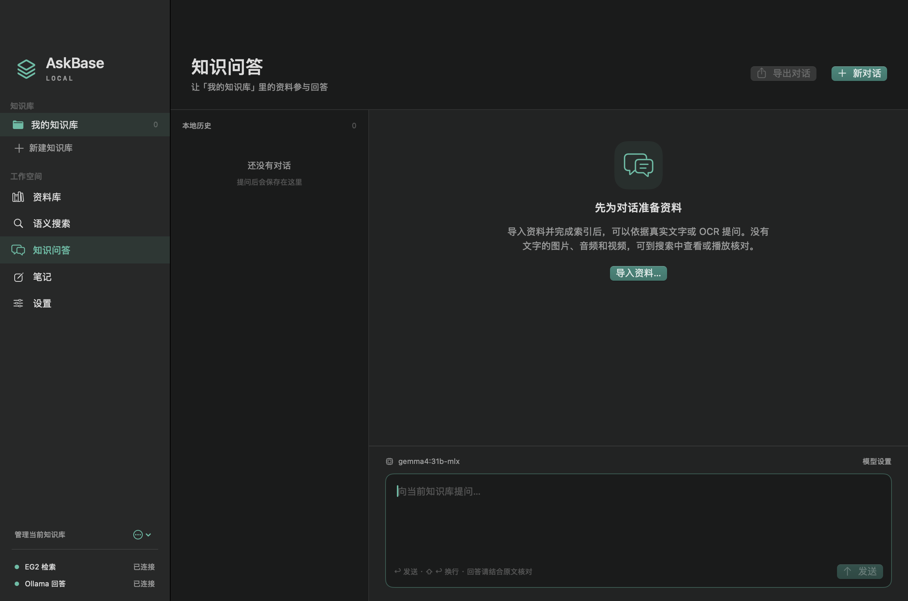

# 输入框与回车发送：0.3.2

日期：2026-10-09，Asia/Shanghai。

空草稿的提示文字和输入光标现在共用原生 TextKit 的字体、容器与起点。普通回车发送，Shift＋回车换行；在输入框内保留 Command＋回车发送与 Option＋回车换行。正在确认中文输入法候选时，回车交由输入法处理；长按回车不会重复发送。不能提问时保持按钮和键盘同样禁发。

保留多行粘贴、选区替换、撤销／重做和滚动。输入框下方空白处也可以点击定位；外部草稿更新后会清理旧的预编辑状态，普通界面刷新不会打断预编辑。输入提示文字只负责显示，不进入问题正文。

## 实现与检查

`ChatComposer.swift` 通过 NSViewRepresentable 包装 NSTextView；`ChatView` 的发送按钮与输入框都调用同一个 AppState.ask()，由既有 canAsk 控制可用性。本次不改模型、检索逻辑、索引或数据库结构。

检查在全新隔离资料库中挂载真实 ChatView，以原生 NSEvent、NSTextInputClient 与私有剪贴板检查输入行为；发送回调用 spy 截获，回答模型请求为零。另保留真实 SwiftUI coordinator 检查，验证绑定回写后的光标、Undo／Redo、预编辑保持和外部草稿替换。深／浅色窗口与多行截图单独人工目视核对。

本次 **79/79** 项原生输入与集成断言通过。下图为应用自身窗口的实际截图（合成空知识库）。

详细结果见 [原生输入检查记录](verification/chat-composer-0.3.2.json)及[独立审查](CHAT-COMPOSER-REVIEW-0.3.2.md)。安装包继承 0.3.1 的云盘协调导入修复；该修复此前完成 153 项核心测试及 11 项实际嵌入服务集成，见[云盘修复报告](CLOUD-IMPORT-FIX-0.3.1.md)。

安装包为 0.3.2/build 6，arm64 Release 构建、临时签名、ZIP 完整性和内嵌许可证核对通过；见[安装包检查](verification/release-artifact-0.3.2.json)。本机同名应用已正常退出后原位更新并启动，原 0.3.1 应用保留为 ZIP 备份。

## 验证边界

以上是本地原创工程检查，不是论文复现或真实业务验收。marked-text 路径检查不能代替每种中文输入法的真人候选窗操作；未覆盖不同输入源、macOS 14 实机或触控板惯性滚动。截图来自应用自身窗口，不读取其他应用。
